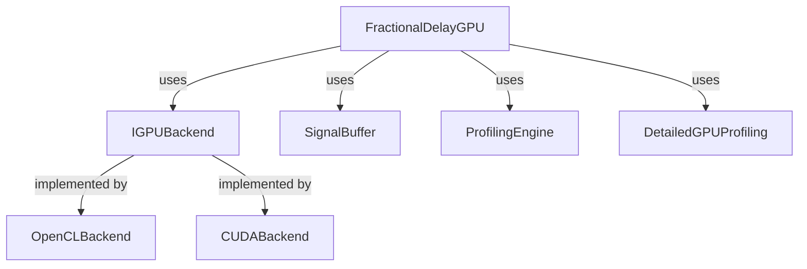

# Fractional Delay GPU Implementation

## Overview

The `FractionalDelayGPU` class provides a high-level interface for performing fractional delay operations on GPU hardware. It integrates with existing components such as `GPUProcessor` and `OpenCLBackend` to provide a complete solution for signal processing with fractional delay compensation.

## Features

- **GPU Acceleration**: Leverages OpenCL for parallel processing on GPU
- **Profiling Support**: Integrated with `ProfilingEngine` and `DetailedGPUProfiling` for performance measurement
- **Memory Management**: Automatic handling of device memory allocation and data transfer
- **Flexible Backend**: Works with any `IGPUBackend` implementation (OpenCL, CUDA, etc.)
- **Lagrange Interpolation**: Supports loading custom Lagrange matrices for high-quality fractional delay

## Class Diagram



## API Reference

### Constructor

```cpp
FractionalDelayGPU(IGPUBackend* backend)
```

Creates a new instance with the specified GPU backend.

### Main Processing Methods

```cpp
bool ProcessFractionalDelay(
    const SignalBuffer& input,
    const float* delay_coeffs,
    SignalBuffer& output,
    ProfilingEngine* profiling_engine = nullptr
)
```

Performs fractional delay processing with optional profiling.

```cpp
bool ProcessFractionalDelayWithDetailedProfiling(
    const SignalBuffer& input,
    const float* delay_coeffs,
    SignalBuffer& output,
    DetailedGPUProfiling& detailed_profiling
)
```

Performs fractional delay processing with detailed GPU event profiling.

### Configuration Methods

```cpp
bool UploadLagrangeMatrix(const float* lagrange_data)
```

Uploads a custom Lagrange matrix to the GPU for interpolation.

```cpp
void EnableProfiling(bool enable)
```

Enables or disables profiling.

### Information Methods

```cpp
SystemInfo GetSystemInfo() const
```

Returns detailed system and GPU information.

```cpp
bool IsInitialized() const
```

Checks if the backend is properly initialized.

## Usage Example

```cpp
#include "fractional_delay_gpu.h"
#include "gpu_backend/gpu_factory.h"
#include "signal_buffer.h"
#include "profiling_engine.h"

int main() {
    // Create GPU backend
    auto backend = GPUFactory::CreateBackend();
    
    // Create fractional delay processor
    FractionalDelayGPU fractional_delay(backend.get());
    
    // Create signal buffers
    SignalBuffer input(4, 1024);
    SignalBuffer output(4, 1024);
    
    // Fill input with test data
    // ...
    
    // Create delay coefficients
    std::vector<float> delay_coeffs = {0.5f, 1.2f, 2.7f, 3.1f};
    
    // Create profiling engine
    ProfilingEngine profiling;
    profiling.EnableProfiling(true);
    
    // Process fractional delay
    if (!fractional_delay.ProcessFractionalDelay(
        input, delay_coeffs.data(), output, &profiling)) {
        std::cerr << "Processing failed!" << std::endl;
        return 1;
    }
    
    // Print results
    profiling.ReportMetrics();
    
    return 0;
}
```

## Performance Considerations

1. **Memory Transfer**: Minimize host-to-device and device-to-host transfers by processing data in batches.

2. **Work Group Size**: The optimal work group size depends on the GPU architecture. The class uses 256 as a default, which works well for NVIDIA RTX 3060.

3. **Lagrange Matrix**: The matrix should be uploaded once and reused for multiple processing operations.

4. **Profiling Overhead**: Detailed profiling adds some overhead due to event synchronization. Use it only when needed for performance analysis.

## Integration with Existing Code

The `FractionalDelayGPU` class is designed to work seamlessly with existing components:

- **GPUProcessor**: Can be used as an alternative or complementary to the existing `GPUProcessor` class
- **SignalBuffer**: Works directly with the existing signal buffer structure
- **ProfilingEngine**: Integrates with the existing profiling infrastructure
- **OpenCLBackend**: Uses the existing OpenCL backend implementation

## Error Handling

The class performs comprehensive error checking:

- Validates input signal buffers
- Checks for null pointers
- Verifies backend initialization
- Handles OpenCL errors through the backend

## Future Enhancements

- Support for CUDA backend
- Asynchronous processing mode
- Batch processing optimization
- Automatic work group size tuning
- Integration with FFT processing pipeline

## See Also

- [OpenCL Backend Documentation](Doc/clFFT/readme_clFFT.txt)
- [Signal Processing Pipeline](Doc/FRACTIONAL_DELAY_ROUTE.md)
- [Profiling Guide](Doc/DEBUG_FRACTIONAL_DELAY.md)
